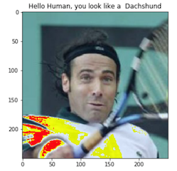

# Convolutional Neural Networks

## Project: An Algorithm for Image Classification ( Dog Identification App) 

### Why We're Here 

In this notebook, you can find an image classification algorithm that could be used as part of a mobile or web app. The code will accept any user-supplied image as input, if a dog is detected in the image, it will provide an estimate of the dog's breed.  If a human is detected, it will provide an estimate of the dog breed that is most resembling.  The images below display the potential sample output of this project. 

       


This project has pieced together a series of models to perform different tasks; for instance, the algorithm that detects humans in an image will be different from the CNN that infers dog breed. This algorithm can certainly be extended to detect your desired objects in an image. This CNN image classification project would be a good starting point to help understand how CNN can learn features from an image, and making good prediction of an unseen image. By changing the datasets, the CNN algorithm can be used for image recognition and OCR, object detection for self-driving cars, face recognition on social media, image analysis in healtcare, and image analysis on stock volatility in Financial market.  

## Project Instructions

### Instructions

1. Open your terminal and clone the repository, then navigate to the the project folder.
```
git clone https://github.com/AndyTKH/Deep-Learning.git                                                          
cd Deep-Learning/Image_Classification_Project
```
2. Open the notebook to view the project. 
```
jupyter notebook Image_Classification.ipynb
```
3. Simply close the terminal window to exit Jupyter Notebook. 
