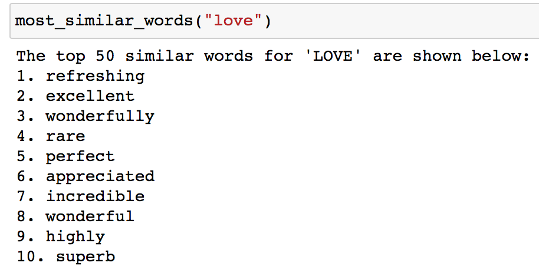
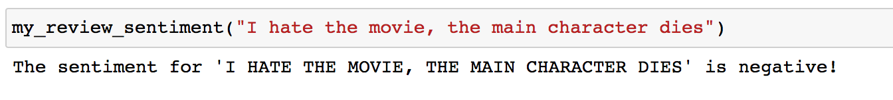

# Sentiment Classification for a Neural Network
## Why We're here

Natural Language Processing is the study of human language using tools such as Machine Learning, or in this case Deep Learning. In this notebook, the Sentiment Classification Neural Network will take in human generated text as inputs and output the text with positive or negative label. Hence, the goal of the Neural Network is to discover the correlation between the input and output data. To find this correlation, we are required to curate our dataset for text inputs and label pairs, transform our textual input data into numerical form, increase signal and reduce noise in data set, increase efficiency in our neural network, train the neural network, and make accurate prediction. The function `most_similar_words` and `my_review_sentiment` below display sample output of this project. 

 

