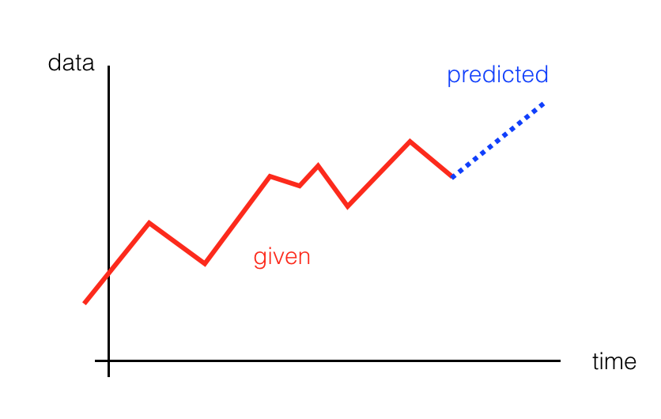

# Stock prediction using RNN

In this notebook, we're going to train RNN to do **time-series prediction**. Given some set of input data, it should be able to generate a prediction for the next time step! In this project, Tesla stock prices data are used for our model prediction.

